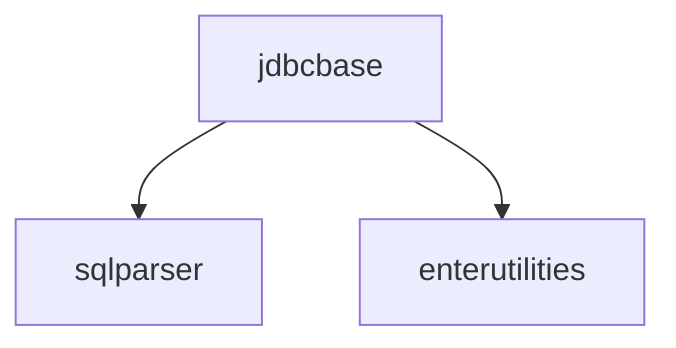

# JdbcBase - SIARD JDBC-Wrapper Base
JdbcBase was developed as part of the SIARD project, and is used by all its JDBC wrapper implementations in order to achieve a common, truly standardized (JDBC 4.1 and SQL:2008) access to various proprietary databases.

### Build the project
```shell
./gradlew clean build
```

### Create a release
This creates a new tag and pushes the tag to main branch.
```shell
./gradlew release
```

### Dependencies


Note that the dependencies SqlParser and EnterUtilties are not released as artifacts. A not-so-well documented feature of Gradle is used instead: Source Dependencies. See https://blog.gradle.org/introducing-source-dependencies for an introduction.

The source dependencies are defined in the `settings.gradle.kts` file.


## Declaration
Contributions to the codebase have been made with the support of Codeium. Codeium is AI-powered code completion tool, that is trained exclusively on natural language and source code data with [permissive licenses](https://codeium.com/blog/copilot-trains-on-gpl-codeium-does-not ). 


## Varia
### Registering a JDBC Wrapper
The class BaseDriver implements the static method register(), which makes sure that the wrapped JDBC driver is not activated instead of the wrapper. It is recommended that every wrapper derived from JdbcBase uses this method for registering itself with the DriverManager.

An important method to override in a JDBC wrapper is Driver.acceptsURL(). It defines which JDBC connection URLs are handled by the wrapper.

### Tests
The implementation of an interface like the JDBC interface is verified by the tests applied to all methods defined in the interface. The tests in jdbcbase-test.jar are all very primitive, and should be overridden in concrete JDBC wrappers. However, this is only necessary when something more elaborate is needed.

In addition to the tests for every JDBC interface method, JdbcBase has a number of utilities for generating random strings and random binary files, which are needed when verifying that a value inserted in a database remains unchanged when it is read.


### Licenses
A copy of all licenses can be found in the doc/licenses folder of the distribution ZIP file. A copy of all third-party binaries used by JdbcBase can be found in the lib folder of the distribution.


### Creating a Standardized Wrapper for a Proprietary JDBC Driver
The typical users of the JdbcBase binaries are developers who want to implement a facade of the JDBC driver of a proprietary JDBC implementation of a database management system (DBMS).

They will usually make use of an extension of SqlParser which parses standard SQL:2008 statements and formats them to their proprietary syntax. This extension of SqlParser is then used to implement Connection.nativeSQL(). Implementations of Statement.execute() methods will then first call Connection.nativeSQL() to translate the query to native proprietary SQL, which is then handed to the proprietary JDBC driver for execution.

#### DatabaseMetaData
The proprietary implementations of the interface DatabaseMetaData are often particularly weak. It will often be necessary to implement replacements based on the proprietary structures containing metadata information about the database.

#### Data Types
Almost all databases implement data types that are different from the SQL standard and do not implement some of the standard types. As SIARD is particularly interested in obtaining the correct data stored in a database, the standardization of data types is an important part of implementing a JDBC wrapper for SIARD.

#### Strategy for creating a JDBC wrapper for SIARD
First all proprietary "simple" (non-UDT) predefined data types must be listed using DatabaseMetaData.getTypeInfo(). Then it must be decided how to map these data types to standard SQL:2008 types defined in the enumeration `ch.enterag.sqlparser.datatype.enums.PreType`. Similarly, the inverse mapping from standard data types to proprietary data types must be decided. These mappings must make sure that no data get lost. These decisions about the mappings will then guide the implementations of `DatabaseMetaData`, `ResultSetMetaData` and `ResultSet` to present that database as a standard SQL:2008 database with standard type to the caller.

It is useful to create a test database `TestSqlDatabase` with a table using all SQL:2008 simple standard data types as well as a test database `TestNativeDatabase` with a table using all proprietary native data types.

If the database supports complex types (ARRAYs, UDTs), a table using complex datatypes should also be created in both databases.

The tests of ResultSet should then implement:

`testGetObjectSqlSimple()`  
`testGetObjectSqlComplex()`  
`testGetObjectNativeSimple()`  
`testGetObjectNativeComplex()`  

to check that the values retrieved for all columns of the test tables are the same as those stored in the test databases.

Similarly, the round-trip tests

`testInsertRowSimple()`  
`testInsertRowComplex()`  

should be implemented, where one row is inserted into each table of TestSqlDatabase and then read again, comparing their values (see the project JdbcOracle as an example).

#### Query Standardization
SIARD makes extensive use of DatabaseMetaData, so the adherence to the standard API is very important for these methods. However, only very simple single-table queries are issued by SIARD to read the table values or the sizes and lengths. Also for the upload of a table, SIARD uses relatively simple CREATE statements for types and tables and makes use of JDBC `insert()` methods for filling the tables. So for making use of a JDBC wrapper for SIARD it may be sufficient to support only a small subset of all possible SQL queries.

On the other hand it may be of interest to have general, standardized JDBC interfaces to various databases that adhere all to the same standard and implement a large portion of the SQL ISO standard. In that case, the JDBC wrappers - originally only implemented to present the same interface to SiardCmd - could be extended to fully support standard SQL as well as standard JDBC.

